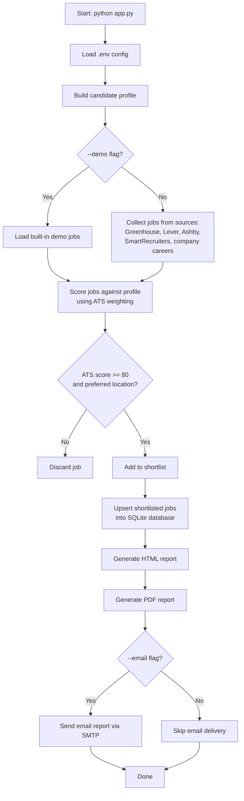

# AI-Powered DevOps Job Matching Bot

This project implements the MVP described in the PRD for a daily AI-powered DevOps job matching bot.

## What it does

- Aggregates candidate jobs from common ATS sources and company career pages
- Normalizes and deduplicates job records
- Includes direct application URLs, company websites, salary ranges, locations, and technology tags when available
- Demo results use real company career websites; links are labeled as company careers pages unless a live role URL was returned by an ATS
- Scores each role against a DevOps candidate profile using the ATS weighting from the PRD
- Saves the result set to SQLite
- Generates a daily HTML email report and PDF summary
- Supports Docker and GitHub Actions scheduling

## Quick start

1. Create a virtual environment:
   python3 -m venv .venv
   source .venv/bin/activate
2. Install dependencies:
   pip install -r requirements.txt
3. Run the demo workflow:
   python app.py --demo

This generates an HTML report under `out/daily-job-report.html` and a PDF under `out/daily-job-report.pdf`.

## Environment configuration

Copy `.env.example` to `.env` and set the required values, especially `OPENAI_API_KEY` if you want LLM-powered scoring.

## Workflow

## Project layout

- `app.py` orchestrates the job collection, matching, DB write, and report generation
- `matcher.py` contains ATS scoring logic
- `emailer.py` renders the HTML/PDF reports
- `database/db.py` handles SQLite persistence
- `parsers/` contains the job collection logic
- `templates/` holds the HTML email template
- `.github/workflows/jobs.yml` defines the scheduled daily runs

## Roadmap alignment

This MVP covers the Week 1-3 goals from the PRD with a working local workflow and production-friendly structure.
